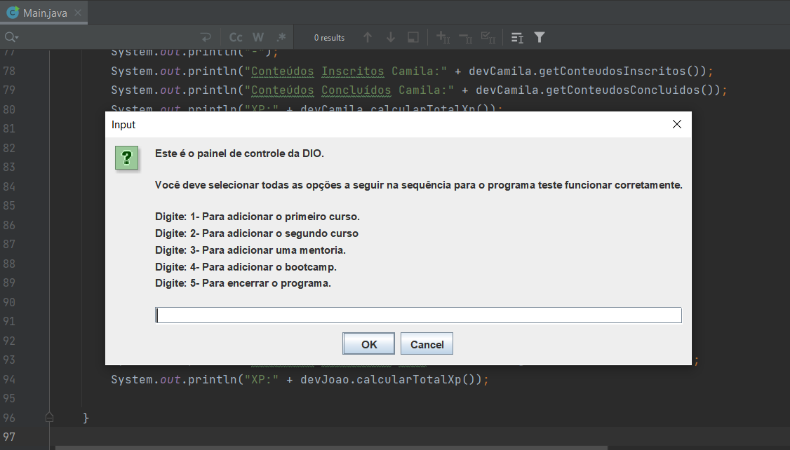

# Projeto: Abstraindo um Bootcamp Usando Orientação a Objetos em Java

Este é o repositório referente ao projeto do Bootcamp em Java da Digital Innovation One.

Neste projeto aplicamos as bases da POO para criar um cadastro de Bootcamps.

Em relação ao projeto original eu adicionei:

1 - O Lombok para reduzir o código gerado com os Getters, Setters, Equals e HashCode.

2 - Além disso adicionei o JOptionPane para capturar uma parte dos dados de entrada referentes ao cadastro dos cursos, mentorias e bootcamps. Desta forma a adição dos valores ficou simplificada.

Segue abaixo um exemplo da modificação:

